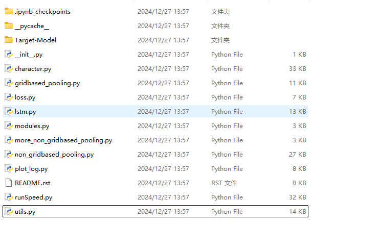

# AGNS : adversarial attack against human trajectory model based on attention-guidance and node-selection

## Installation:

Start by cloning this repository:
```
git clone https://github.com/Guoxn1/AGNS
```

And install the dependencies:
```
pip install .
```
For more info on the installation, please refer to [Trajnet++](https://thedebugger811.github.io/posts/2020/03/intro_trajnetpp/)

## Dataset:

  * We used the trajnet++ [dataset](https://github.com/vita-epfl/trajnetplusplusdata/releases/tag/v4.0). For easy usage, we put data in DATA_BLOCK folder.

## Catalog Introduction

Our runtime entry files are located in the trajnetbaselines directory, corresponding to the four models in the lstm and sgan subdirectories. Taking the lstm directory as an example, runSpeed.by can verify our discussion on attacks in the experiment, where a small number of perturbed nodes cause prediction errors in the model. Combined with experimental results data and an independent Python file get_dest.py, the correctness of the results can be verified, corresponding to experimental sections a and b. The characterizations. py file can verify the weight size of the importance of the last node, corresponding to the experimental section c.



## Training/Testing:

In order to attack the models :
```
python -m trajnetbaselines.lstm.runSpeed --lr 0.01 --layer_dims 1024 --barrier 0.2 --show_limit 50 --type d_pool --reg_noise 0.1 --reg_w 0.7 --perturb_all true --threads_limit 1 --data_part test --collision_type hard --speed_up true --sample_size 100 --enable_thread false --output './out/tmp/' --models_path 'trajnetbaselines/lstm/Target-Model/d_pool.state'
```
## Experimental results and visualization

The data results will be provided at this address: "https://pan.baidu.com/s/1tf6jLZzqZywKsTNuGIyvKA". The data has been uploaded and the access password will be made public later.


## References

* Are socially-aware trajectory prediction models really socially-aware? [Paper](https://arxiv.org/abs/2108.10879) [Code](https://github.com/vita-epfl/s-attack)
* Trajectron++: Dynamically-Feasible Trajectory Forecasting With Heterogeneous Data [Paper](https://link.springer.com/chapter/10.1007/978-3-030-58523-5_40) [Code](https://github.com/StanfordASL/Trajectron-plus-plus)

